## Hello! My name is Ayushka Talele.   
Currently Creating a personal website on blender. Well, trying to.   
3rd year on an FRC team, wiring the robot like there's no tomorrow.  
Usually reading a book or playing minecraft.   
Trying my hand at crocheting and 3d modeling.   

Github Statistics...

  

    
     
     
  
    

## Languages

## Platforms

## Repositories list:  
##### Memorable Repo's:

[Create Task](https://github.com/xFork19/Create-Task): 2024 AP exam submission.  
[Water wise](https://github.com/mwkhettab/waterwise): First place winner at TechCorpsHackathon 2024.  
[7 Levels of Insanity](https://github.com/xFork19/Sunflower): First place at Daydream Columbus. 44/187 at Daydream Global. 2024, 19 hours.  
[CultureShock ](https://github.com/xFork19/TECHCORPS-CultureShock ): TechCorpsHackathon submission. Code transfer failed, but available in readMe file. 2025.  
  

##### Girls Who code Summer Immersion Program (2025):  
[Little Hollow](https://github.com/xFork19/Little-Hollow): 3 day game jam result, 40 hours. Figure out how to wake up using a ... guitar?   
[Abandoned School Analoug](https://github.com/xFork19/Abandoned-School-Analoug-AT): CYOA game. Escape the haunted building. multiple endings.  
[Collection Game](https://github.com/xFork19/Collection-Game-AT): Mario Styled collection game. Grab coins, avoid the bombs 

##### Girls who code Fall pathways (2025):  
HTML, CSS: [Personal Website](https://github.com/xFork19/Ayushka-Taleles-website), [Personality Quiz](https://github.com/xFork19/Ayushkas-Personality-Quiz), [Alzheimers Website](https://github.com/xFork19/Alzheimers-Awareness).  
Python:  [CyHelp](https://github.com/xFork19/Ayushka-T-CyHelp), [BreachBot](https://github.com/xFork19/Ayushka-T-Breach-Bot), [Caesar Cypher](https://github.com/xFork19/Ayushka-T-Caesars-Cipher) ,
[Advanced Caesar Cypher](https://github.com/xFork19/Ayushka-T-Advanced-Caesars-Cipher), [Ceaser Cypher Breaker](https://github.com/xFork19/Ayushka-TCracking-Caesars-Cipher).

### Contacts

